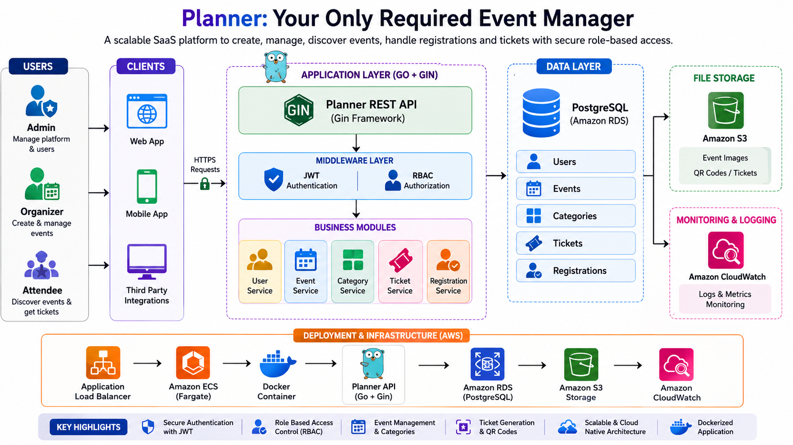

# Planner - Event Manager

**Planner** is a modern, scalable, and secure event management backend built with **Go**. Designed with a SaaS-first architecture, it enables users to discover events, organize their own events, manage registrations, and interact through a secure JWT-based authentication system.

The platform follows a clean backend architecture with a strong emphasis on **security, maintainability, and scalability**, making it suitable as the foundation for a production-grade event management solution.

---

## System Architecture




## Core Features

### 👤 User Management & Authentication

* User registration and login workflows
* Secure password hashing using bcrypt
* JWT-based authentication and session management
* Protected API endpoints using authentication middleware
* User-specific authorization for event management

### 🎯 Event Management

* Create and publish events
* Browse all available events
* Retrieve detailed information about individual events
* Update event details
* Delete existing events
* Ownership-based authorization (only creators can modify their events)

### 🎟️ Event Registration System

* Register for available events
* Cancel existing registrations
* Manage attendee participation

### 🏗️ Backend Architecture

* RESTful API design principles
* Modular project structure following separation of concerns
* Database abstraction through models and data access methods
* Middleware-driven authentication flow
* Clean error handling and request validation

---

## Technology Stack

| Technology    | Purpose                                    |
| ------------- | ------------------------------------------ |
| Go (Golang)   | High-performance backend development       |
| Gin Framework | REST API routing and middleware            |
| PostgreSQL    | Relational database management             |
| JWT           | Stateless authentication and authorization |
| bcrypt        | Password hashing and security              |
| Postman       | API testing and endpoint validation        |
| Git & GitHub  | Version control and collaboration          |

---

## API Endpoints

### Authentication

| Method | Endpoint  | Description                             |
| ------ | --------- | --------------------------------------- |
| POST   | `/signup` | Create a new user account               |
| POST   | `/login`  | Authenticate user and receive JWT token |

---

### Event Management

| Method | Endpoint      | Access             | Description                   |
| ------ | ------------- | ------------------ | ----------------------------- |
| GET    | `/events`     | Public             | Retrieve all available events |
| GET    | `/events/:id` | Public             | Retrieve event details        |
| POST   | `/events`     | Authenticated User | Create a new event            |
| PUT    | `/events/:id` | Event Owner        | Update an existing event      |
| DELETE | `/events/:id` | Event Owner        | Delete an event               |

---

### Event Registration

| Method | Endpoint               | Access             | Description                     |
| ------ | ---------------------- | ------------------ | ------------------------------- |
| POST   | `/events/:id/register` | Authenticated User | Register for an event           |
| DELETE | `/events/:id/register` | Authenticated User | Cancel an existing registration |

---

## Project Structure

```text
planner/
│
├── main.go                # Application bootstrap
│
├── routes/                # API endpoint handlers
│   ├── events.go
│   └── users.go
│
├── models/                # Database models and operations
│   ├── event.go
│   └── user.go
│
├── middleware/            # JWT authentication and request protection
│
├── db/                    # Database connection and schema initialization
│
├── utils/                 # Utility functions
│   ├── password.go        # Password hashing and verification
│   └── token.go           # JWT creation and validation
│
└── api-test/              # Postman collections and API testing files
```

---

## Security Practices

Planner incorporates several security mechanisms:

* Passwords are never stored in plain text
* Passwords are hashed using bcrypt before persistence
* JWT tokens secure authenticated requests
* Authorization checks prevent unauthorized event modifications
* Input validation protects API endpoints from malformed requests
* Prepared SQL statements are used to mitigate SQL injection attacks

---

## 📋 Current Development Roadmap

The platform is actively evolving towards a complete cloud-native SaaS solution.

### User & Administration

* Role-Based Access Control (Admin, Organizer, User)
* Dedicated admin dashboard APIs
* User moderation and management tools

### Event Intelligence

* Event categories and filtering
* Event search capabilities
* Event capacity and seat management
* Event analytics

### Ticketing Platform

* Digital ticket generation
* Unique ticket identifiers
* QR-code based ticket verification
* Ticket lifecycle management

### Infrastructure & DevOps

* Docker containerization
* Docker Compose for local development
* PostgreSQL migration and database versioning
* Cloud deployment on AWS ECS Fargate
* AWS RDS for managed PostgreSQL
* AWS ECR for container image management
* AWS CloudWatch monitoring and logging
* Secrets management for environment configuration

---

## Project Goals

Planner aims to evolve from a REST API into a production-grade **Event Management SaaS Platform** capable of handling user management, event organization, ticketing, and cloud-native deployment.

The project emphasizes modern backend engineering practices including secure authentication, scalable architecture, containerization, and cloud infrastructure.

---

## Contribution

Contributions, issues, and feature suggestions are always welcome. Feel free to fork the repository and open a pull request.

---

## License

This project is open-sourced under the MIT License.

---